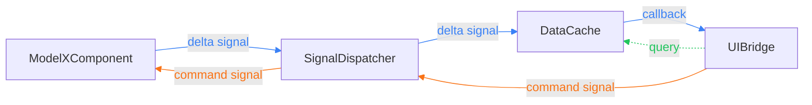
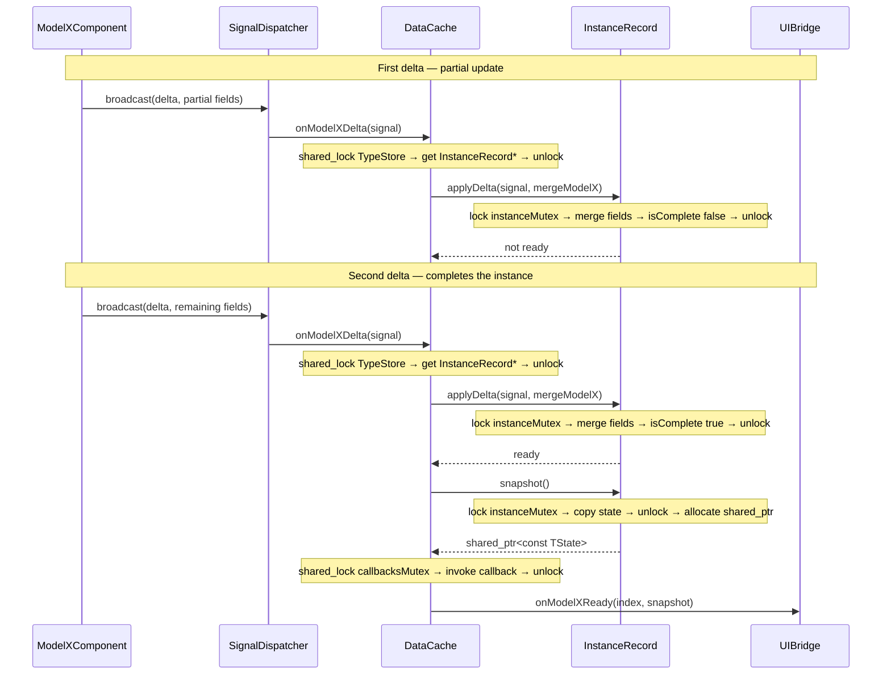
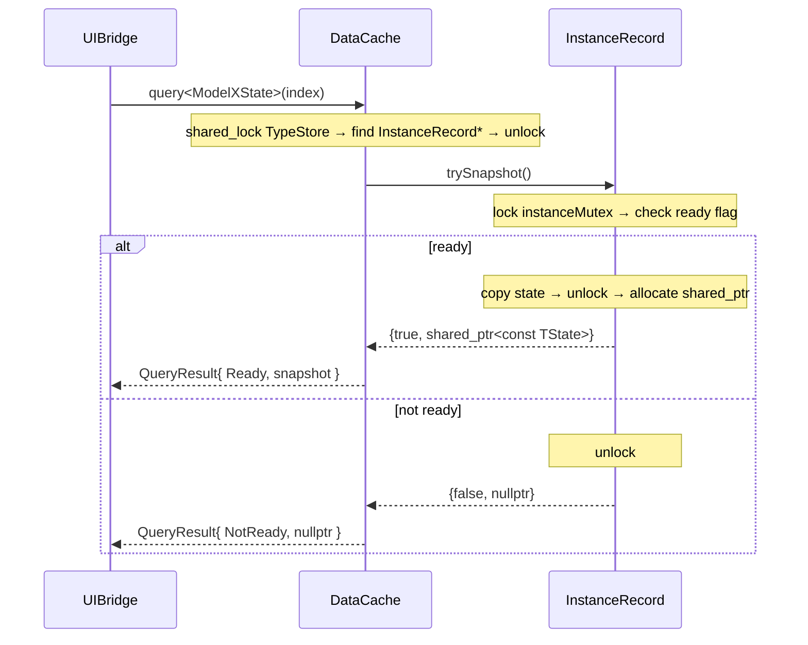
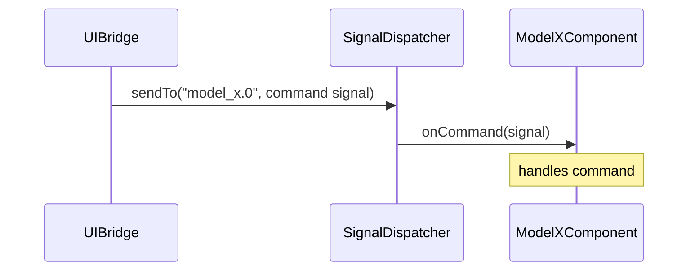

# DataCache — System Design

## Overview

DataCache is a thread-safe, type-dispatched state cache that sits between a real-time simulation layer and a UI layer. It solves two problems:

1. **Partial updates.** Simulation components emit state incrementally — a single field at a time, as it changes. DataCache assembles these fragments into complete, consistent snapshots and only surfaces a snapshot once every required field has been received.

2. **Decoupling.** Components and the UI do not call each other directly. Both talk through a `SignalDispatcher`. DataCache subscribes to delta signals on one side and delivers ready snapshots on the other, so neither side has a compile-time or runtime dependency on the other.

Consumers can receive data in two ways:
- **Push** — register a callback; DataCache fires it the moment a snapshot becomes complete.
- **Pull** — call `query<TState>(index)` at any time to read the latest ready snapshot on demand.

---

## Architecture



| | Flow |
|---|---|
| Blue solid | Push — component emits a delta; DataCache assembles it and fires a callback |
| Green dotted | Query — UIBridge reads the latest snapshot on demand |
| Orange solid | Command — UIBridge sends a directive to a specific model instance |

The three main actors are:

| Actor | Role |
|---|---|
| `ModelXComponent` | Owns a live simulation instance; emits delta signals when state changes; receives command signals |
| `DataCache` | Assembles deltas into snapshots; manages per-instance state; delivers push callbacks and query results |
| `UIBridge` | Consumer-facing facade; owns the DataCache; wires callbacks; exposes query and command APIs |

---

## Key Concepts

### State Types and Inheritance

Each model type has a corresponding state struct that defines the fields it tracks. Fields are `std::optional` — an absent value means that field hasn't been received yet.

Common field groups are factored into base structs in `cache/State/Base/`:

| Base struct | Fields |
|---|---|
| `PhysicsState` | `temperature`, `pressure` |
| `ElectricalState` | `voltage` |
| `MechanicalState` | `rpm`, `torque` |

Concrete state types inherit from whichever bases cover their domain and add any model-specific fields:

```cpp
// ModelDState spans all three domains — no extra fields needed
struct ModelDState : PhysicsState, ElectricalState, MechanicalState {
    static bool isComplete(const ModelDState& s) {
        return s.temperature && s.pressure && s.voltage && s.rpm && s.torque;
    }
};

// ModelEState adds electrical-only fields to ElectricalState
struct ModelEState : ElectricalState {
    std::optional<float> current;
    std::optional<float> frequency;

    static bool isComplete(const ModelEState& s) {
        return s.voltage && s.current && s.frequency;
    }
};
```

Every concrete state type provides a `static bool isComplete(const TState&)`. This is the sole definition of what "ready" means for that type. DataCache calls it after every delta merge — no other code needs to know the predicate.

### Delta Signals

Each model type has a corresponding delta signal (`Models/ModelX/Signals/ModelXDeltaSignal.h`). Delta signal fields mirror the state fields but are all `std::optional`: only the fields that changed in a given update are populated. Unpopulated fields are ignored during the merge.

```cpp
struct ModelADeltaSignal : sd::Signal {
    int numericIndex;              // which instance this update is for

    std::optional<float> temperature;
    std::optional<float> pressure;
    std::optional<float> voltage;
    std::optional<float> flowRate;
};
```

### InstanceRecord\<TState\>

`InstanceRecord` (`cache/InstanceRecord.h`) is the per-instance unit of storage. It holds:

- The in-progress `TState` value being assembled from deltas
- A `ready` flag — set to `true` once `isComplete` first returns `true`, never reset
- An `instanceMutex` (`std::mutex`) protecting both

Two key operations:

```
applyDelta(signal, applyFn)
  → acquires instanceMutex
  → calls applyFn(state, signal) to merge populated fields
  → calls TState::isComplete(state); sets ready if true
  → returns ready

trySnapshot()
  → acquires instanceMutex
  → if not ready: returns {false, nullptr}
  → copies state, releases mutex
  → allocates shared_ptr<const TState> outside the lock
  → returns {true, snapshot}
```

Allocation happens outside the lock to minimise contention under concurrent reads.

### TypeStore\<TState\>

`TypeStore` (`cache/DataCache.h`) bundles the instance map and its own `std::shared_mutex` for one state type:

```cpp
template<typename TState>
struct TypeStore {
    std::unordered_map<int, std::unique_ptr<InstanceRecord<TState>>> records;
    mutable std::shared_mutex mutex;
};
```

Map lookups (delta processing, queries) hold a **shared lock** — multiple threads can run concurrently. Structural changes (`reserve`, `addInstance`) hold an **exclusive lock**.

### DataCache

`DataCache` (`cache/DataCache.h`, `cache/DataCache.cpp`) is the central coordinator. It holds one `TypeStore` per model type in a compile-time tuple:

```cpp
std::tuple<
    TypeStore<ModelAState>,
    TypeStore<ModelBState>,
    // ...
    TypeStore<ModelIState>
> stores_;
```

`std::get<TypeStore<TState>>(stores_)` gives O(1) access to the right store at compile time — no runtime map lookup on the hot path.

**Key methods:**

| Method | Description |
|---|---|
| `reserve<TState>(n)` | Pre-allocates `n` InstanceRecords (indices 0..n-1). One-shot per type. |
| `addInstance<TState>(index)` | Adds a single InstanceRecord at runtime. Safe to call after simulation starts. |
| `setCallback<TState>(fn)` | Registers the push callback for a type. Thread-safe; can be called at any time. |
| `registerHandlers(dispatcher)` | Binds delta signal handlers. Call once at startup. |
| `query<TState>(index)` | Synchronous read; returns `QueryResult<TState>`. |

Internally, all delta processing flows through a single private template:

```cpp
template<typename TState, typename TDelta, typename TApplyFn>
void onDelta(const TDelta& signal, TApplyFn&& applyFn);
```

The non-template `onModelXDelta` methods are thin entry points that call `onDelta` with the correct type parameters. This **template firewall** pattern ensures each `onDelta` instantiation is pinned to one (TState, TDelta) pair regardless of the lambda type — keeping binary size proportional to model count rather than call-site count.

### UIBridge

`UIBridge` (`UIBridge.h`, `UIBridge.cpp`) is the consumer-facing layer. It owns the `DataCache` and holds a reference to the `SignalDispatcher`.

On construction it wires everything:

```cpp
UIBridge::UIBridge(sd::SignalDispatcher& dispatcher) : dispatcher_(dispatcher) {
    dataCache_.setCallback<ModelAState>(...);
    // ... one per model type
    dataCache_.registerHandlers(dispatcher_);
}
```

It exposes:
- `query<TState>(index)` — delegates directly to `DataCache::query`
- `reserveInstances<TState>(n)` / `addInstance<TState>(index)` — lifecycle management
- `sendModelXCommand(index, ...)` — builds and dispatches a command signal to a specific instance

---

## Data Flows

### Push Flow

A component emits partial updates; DataCache assembles them and fires a callback once the instance is complete.



### Query Flow

A consumer reads the latest snapshot directly, bypassing the dispatcher.



`QueryResult{ UnknownIndex, nullptr }` is returned immediately if the index is not found in the TypeStore, before `trySnapshot` is reached.

### Command Flow

The UI sends a directive to a specific model instance.



---

## Concurrency Model

The design uses two independent lock levels. They are never held simultaneously, which prevents deadlock.

**Level 1 — TypeStore::mutex (`std::shared_mutex`)**

Protects the `unordered_map` of InstanceRecords for a given type. Shared lock for reads (delta processing, queries); exclusive lock for writes (`reserve`, `addInstance`). Multiple delta handlers and query calls for different instances can run concurrently.

**Raw pointer safety:** After releasing the shared lock, `onDelta` and `query` hold a raw `InstanceRecord*` obtained from a `unique_ptr`. This is safe because a `unique_ptr` stores its object on the heap — a map rehash moves the `unique_ptr` bookkeeping, not the heap object. Since any concurrent structural change requires an exclusive lock (which cannot be granted while a shared lock is held), the pointer remains valid for the duration of the call.

**Level 2 — InstanceRecord::instanceMutex (`std::mutex`)**

Protects `state` and `ready` within a single instance. Held only for the duration of a field merge or a state copy. The `ready` flag is monotone — once set `true` it is never reset — so there is no torn read risk from checking it.

**Callbacks — callbacksMutex\_ (`std::shared_mutex`)**

Protects the `callbacks_` map. `setCallback` takes an exclusive lock; `publish` takes a shared lock. This makes `setCallback` safe to call at any time, including concurrently with active delta processing.

---

## Extension Guide — Adding a New Model Type

Follow this checklist in order:

1. **Base state** — if the new model introduces a field group not already covered by `PhysicsState`, `ElectricalState`, or `MechanicalState`, add a new base struct in `cache/State/Base/`.

2. **State type** — create `cache/State/ModelXState.h` inheriting from the appropriate base(s). Add model-specific `std::optional` fields and implement `static bool isComplete(const ModelXState&)`.

3. **Delta signal** — create `Models/ModelX/Signals/ModelXDeltaSignal.h`. Mirror the state fields as `std::optional` members; include `int numericIndex`.

4. **Command signal** — create `Models/ModelX/Signals/ModelXCommandSignal.h` with whichever fields the UI needs to direct at this model.

5. **Component** — create `Models/ModelX/ModelXComponent.h` following the existing pattern: bind the command signal in the constructor, implement `broadcastDelta`, handle the command in `onCommand`.

6. **DataCache** (`cache/DataCache.h`) — add `TypeStore<ModelXState>` to the `stores_` tuple; declare `onModelXDelta` and `static mergeModelX`.

7. **DataCache** (`cache/DataCache.cpp`) — implement `mergeModelX` (copy populated optionals from delta into state), implement `onModelXDelta` (call `onDelta<ModelXState>`), and register the handler in `registerHandlers`.

8. **UIBridge** (`UIBridge.h` / `UIBridge.cpp`) — add `setCallback<ModelXState>` in the constructor, add `sendModelXCommand`, and implement `onModelXReady`.

9. **CMakeLists.txt** — add `Models/ModelX` and `Models/ModelX/Signals` to `target_include_directories`.
